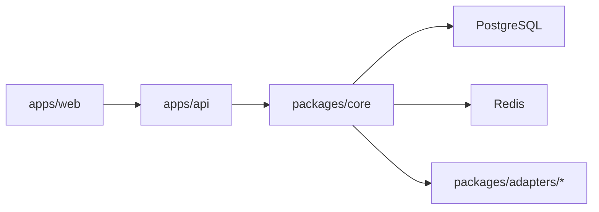

# Integrator Platform OSS

Self-hostable, enterprise-oriented AI automation platform for teams that want visual workflow orchestration, governed agent execution, and operational reliability.

## What Integrator Is

Integrator is a TypeScript monorepo product similar in category to Zapier, n8n, and Make, focused on:

- visual automation design with a free-form builder canvas
- adapter/plugin extensibility
- AI + agent workflows with human approval controls
- tenant-safe, RBAC-controlled operation
- production observability (runs, audit logs, alerts, metrics)

## Current System Snapshot

### Visual Builder

- free canvas with draggable nodes
- rendered edges with branch path visualization
- zoom, pan, minimap, and edge rewiring foundation
- inspector-based editing for trigger/action/branch/delay/AI nodes

### Integrations

- support model split: `native`, `generic`, `community`
- readiness tiers: `ready`, `advanced`, `coming_soon`, `developer`
- app catalog with guided setup and connection trust states

### Messaging

- Telegram connector (message trigger + send action)
- WhatsApp Cloud API connector (message trigger + send action)

### Creator Automation

- YouTube connector for creator workflows
- Reddit connector for community monitoring and summaries

### AI Layer

- generate, rewrite, summarize, transform, classify, and key-point extraction
- AI nodes in builder for content and agent-style flows

### Agent System

- typed tool registry and permission allow-listing
- bounded execution loop (`runAgent`)
- reasoning timeline blocks in Runs UX
- memory support: run-level + workflow-level
- human approval workflow (pending/approve/deny)
- continuation/resume semantics after approval

### Observability

- run history, run detail timeline, and retry/dead-letter visibility
- operator audit logs with filters and drill-down
- alert settings and delivery channels
- metrics and analytics endpoints

### Templates + Onboarding

- built-in template library
- first-success onboarding and goal-first flow
- in-app simulator and guided test path for webhook-led starts

## Architecture

See detailed architecture and runtime flow in [`docs/architecture.md`](./docs/architecture.md).

At a glance:

- `apps/api`: Express control plane + webhook ingress + worker entrypoint
- `apps/web`: React product UI (catalog, builder, runs, approvals, alerts, audit)
- `packages/core`: workflow engine, auth, queue/retry/scheduler, approvals, memory, observability
- `packages/shared`: typed contracts, shared utilities, AI utility layer
- `packages/adapters/*`: manifest-driven adapters (native/generic/community)
- PostgreSQL: source of truth for entities, runs, approvals, audit, memory
- Redis: queue transport and worker scheduling coordination



## Enterprise Capabilities

- JWT auth with organization/workspace scoping
- RBAC roles (`owner`, `admin`, `member`) with protected operator actions
- tenant isolation across integrations, workflows, runs, logs, credentials, approvals, memory
- approval lifecycle for high-safety tool execution
- structured audit logging for operator and security-relevant actions
- controlled tool execution with explicit permissions and approval gates
- execution traceability through run timeline + agent reasoning timeline

## Roadmap (Phased)

Phased roadmap is documented in [`ROADMAP.md`](./ROADMAP.md):

1. Phase 1 (Complete): current implemented platform systems
2. Phase 2 (Enterprise Hardening): approval expiry/policies, stronger sandbox controls
3. Phase 3 (AI Expansion): vector memory, richer streaming, deeper orchestration
4. Phase 4 (Ecosystem): broader integrations and template distribution
5. Phase 5 (MCP): external MCP server and ecosystem exposure

## UI/UX System Docs

Read [`docs/UI_SYSTEM.md`](./docs/UI_SYSTEM.md) for:

- design principles (`flow-first`, `agent-first`, progressive complexity)
- builder/canvas interaction model
- agent reasoning UX patterns
- runs, catalog, and onboarding UX conventions

## Setup Guide System (Critical)

Read [`docs/SETUP_GUIDE_SYSTEM.md`](./docs/SETUP_GUIDE_SYSTEM.md) for:

- setup guide data model (`overview -> requirements -> input -> test -> success`)
- `/api/v1/apps` setup metadata flow
- `platformSetupMissingFields` trust and readiness signaling
- wizard-first setup UX standards and post-connect routing

## Quick Start

1. Install:

```bash
npm install
```

2. Run one-time local setup:

```bash
npm run setup:local
```

3. Start API + worker + web:

```bash
npm run dev:local
```

4. Open:

- Web: `http://localhost:3000`
- API health: `http://localhost:4000/api/v1/health`
- Metrics: `http://localhost:4000/metrics`

## First Success Path

1. Sign in with seeded dev credentials (`admin@example.com` / `dev-password`).
2. Open onboarding.
3. Connect an app from the catalog.
4. Choose a starter template.
5. Run simulator/test event.
6. Inspect Runs, Audit, and Alerts.

## Reference Alignment (Inspiration, Not Copying)

Integrator design patterns are inspired by ecosystem leaders while being natively implemented:

- n8n: visual builder and node workflow mental model
- Plane: clear operational states and information hierarchy
- AppFlowy: workspace/product cohesion
- Coolify and Dokku: self-host simplicity and operator-first setup
- ERPNext: integrated platform breadth and completeness

No external project code is imported into runtime from these references.

## Deeper App/Package Docs

- [`apps/api/README.md`](./apps/api/README.md)
- [`apps/web/README.md`](./apps/web/README.md)
- [`packages/core/README.md`](./packages/core/README.md)
- [`packages/adapters/README.md`](./packages/adapters/README.md)

## Demo Assets and Launch Checklists

- Demo assets guide: [`apps/web/demo-assets/README.md`](./apps/web/demo-assets/README.md)
- Launch smoke checklist: [`LAUNCH_CHECKLIST.md`](./LAUNCH_CHECKLIST.md)

## License

MIT.
