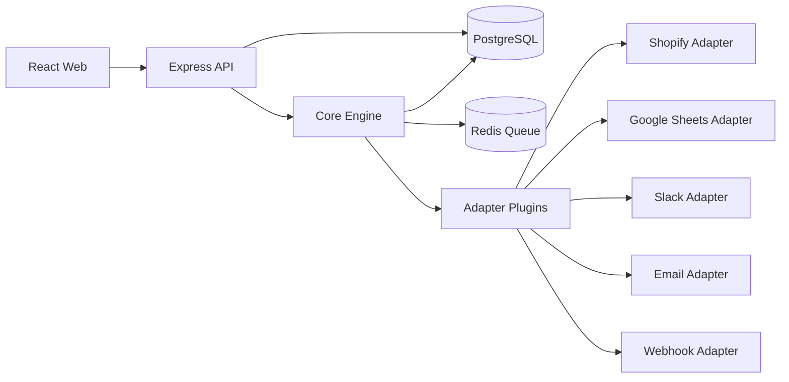

# Integration Platform v1 (Monorepo)

Node.js + TypeScript integration platform with:

- `apps/api`: Express API + webhook endpoint + worker process
- `apps/web`: React TypeScript UI
- `packages/core`: Postgres/Redis runtime, migrations, engine, repositories
- `packages/shared`: shared adapter interfaces/types/utilities
- `packages/adapters`: plugin adapters (webhook, sheets, email, shopify, slack)

## Stack

- Runtime: Node.js, TypeScript
- API: Express
- UI: React (Vite)
- DB: PostgreSQL
- Cache/Queue: Redis
- Local deployment: Docker Compose

## Monorepo Layout

```text
apps/
  api/
  web/
packages/
  core/
  shared/
  adapters/
    webhook/
    sheets/
    email/
    shopify/
    slack/
    http-api/      # TODO placeholder (v1 non-implemented)
    scheduler/     # TODO placeholder (v1 non-implemented)
infra/
  terraform/
  helm/
```

## Architecture



## Adapter Interface

Defined in [`packages/shared/src/types/adapter.ts`](packages/shared/src/types/adapter.ts):

- `init`
- `authenticate`
- `listTriggers`
- `listActions`
- `runTrigger`
- `runAction`
- `validateConfig`
- `refreshToken`

## Database Migrations

SQL migrations are in `packages/core/src/migrations` and include:

- `users`
- `organizations`
- `workspaces`
- `integrations`
- `credentials`
- `workflows`
- `workflow_steps`
- `workflow_runs`
- `event_logs`
- `retry_queue`
- `audit_logs`

All tables include tenant/workspace context and indices.

## Workflow Definition Format

Validated by `packages/core/src/workflow/schema.ts`.

```json
{
  "id": "wf_shopify_to_slack",
  "name": "Shopify -> Slack",
  "workspaceId": "workspace-uuid",
  "organizationId": "org-uuid",
  "trigger": {
    "adapter": "shopify",
    "trigger": "order_created",
    "config": {}
  },
  "steps": [
    {
      "id": "step_slack_notify",
      "adapter": "slack",
      "action": "sendMessage",
      "config": {
        "channel": "#ops",
        "text": "New order received"
      },
      "onError": "stop"
    }
  ],
  "enabled": true
}
```

## API Endpoints

Base URL: `/api/v1`

- `GET /health`
- `GET/POST /workspaces`
- `GET/POST /integrations`
- `POST /integrations/:adapterKey/auth/start`
- `POST /integrations/:adapterKey/auth/callback`
- `GET/POST /credentials`
- `GET/POST /workflows`
- `GET /runs`
- `GET /logs`
- `POST /webhook/:adapterKey/:triggerKey`

## Local Development

1. Copy env file:

```bash
cp .env.example .env
```

2. Install:

```bash
npm install
```

3. Run with Docker Compose:

```bash
docker compose up --build
```

4. Or run locally:

```bash
npm run migrate
npm run dev
npm run start:worker
```

## Tests

Adapter unit tests are included for:

- webhook
- sheets
- email
- shopify
- slack

Run:

```bash
npm test
```

## Adding an Adapter

1. Create `packages/adapters/<name>/`.
2. Add `package.json`, `manifest.json`, `tsconfig.json`, `src/index.ts`.
3. Implement `Adapter` from `@integration/shared`.
4. Register adapter in `packages/core/src/index.ts`.
5. Add tests for init/auth/trigger/action behavior.

## v1 Scope Notes

- Implemented adapters: `webhook`, `sheets`, `email`, `shopify`, `slack`.
- Non-v1 placeholders (TODO): `http-api`, `scheduler`.
- No adapters beyond this v1 list are implemented.

