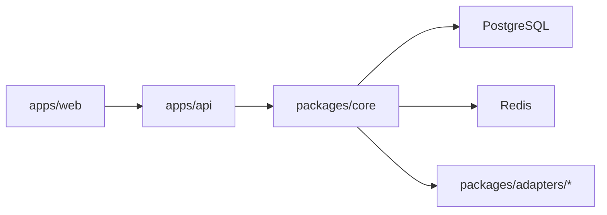

# Integrator Platform OSS

Self-hostable, enterprise-oriented AI automation platform for teams that want visual workflow orchestration, governed agent execution, and operational reliability.

## Official Tech Stack (Phase 1.5A Lock)

- `STACK: React + TypeScript + Vite`
- `STATE: TanStack Query for server state, Zustand for local UI state`
- `BUILDER: React Flow / XYFlow`
- `API: Fastify + Zod`
- `DATA: PostgreSQL`
- `QUEUE: Redis + BullMQ`
- `DEPLOY: Docker Compose + Traefik`
- `CI/CD: GitHub Actions`
- `MODE: Prototype Mode | Live Mode`

## Canonical Frontend Adoption (integrator-platform -> apps/web)

`apps/web` now adopts the `integrator-platform` UI direction as the canonical product surface, while keeping the monorepo runtime contracts and mode behavior.

### Stack Reconciliation

- `integrator-platform` actual frontend stack:
  - React + TypeScript + Vite
  - Zustand local state
  - Tailwind utility styling + component primitives
  - `reactflow` (v11 package)
  - local in-app page switching + mock-data store (no route/API contract parity layer)
- `apps/web` active frontend stack:
  - React + TypeScript + Vite
  - React Router route shell
  - TanStack Query for server-state
  - Zustand for local UI state
  - Tailwind + product CSS system
  - `@xyflow/react` canvas runtime
  - Prototype Mode / Live Mode contract-aware API integration
- final locked target:
  - React + TypeScript + Vite + TanStack Query + Zustand + Tailwind + React Flow / XYFlow

Compatibility classification:

- Fully compatible and preserved:
  - React, TypeScript, Vite
  - Zustand usage patterns
  - Tailwind design language and component layering
  - visual builder mental model
- Partially compatible (adapted):
  - `reactflow` from `integrator-platform` adapted to `@xyflow/react` in `apps/web`
  - local mock-first page state adapted into route/query-driven runtime views
- Conflicts kept out of runtime:
  - mock-data-only page switching router
  - frontend-local data source replacing real API contracts
- Preserved visually only:
  - shell/topbar hierarchy
  - catalog/list/detail visual treatment
  - builder palette/canvas/inspector interaction cues

### Full UI-System Adoption Progress (latest migration pass)

- already migrated (kept and refined in `apps/web`):
  - persistent shell + grouped navigation + quick switch
  - dashboard + onboarding + first automation flow
  - workflows list + visual builder shell
  - integrations catalog and setup flow
  - runs, alerts, audit, approvals consoles
- newly migrated in this pass:
  - settings console expansion (`/settings`)
  - profile surface (`/profile`)
  - organization surface (`/organization`)
  - docs hub (`/docs`)
  - files surface (`/files`)
  - communication workspace surface (`/communication`)
  - facility management surface (`/facility`)
  - maintenance system surface (`/maintenance`)
  - operational calendar surface (`/calendar`)
  - unified nav/context metadata for these routes
  - shared future-workspace helpers with mode-aware fixture data
- preserved from existing `apps/web` runtime:
  - React Router route structure
  - TanStack Query server-state boundaries
  - Zustand local UI state boundaries
  - `@xyflow/react` builder runtime
  - Prototype Mode and Live Mode contract-aware API integration
- adapted from `integrator-platform`:
  - list/detail knowledge and asset UX patterns
  - profile/organization workspace framing
  - future-facing collaboration-style surfaces as runtime-light pages
- deferred for later phases:
  - full rich editors/collaboration stack from `integrator-platform` (docs/files/chat realtime internals)
  - deep storage and document backend services (UI is ready, runtime intentionally light)

`apps/web` is the canonical frontend implementation path. `integrator-platform` remains in-repo as migration history/reference only and is not an active runtime or feature-development target.

## Frontend Source of Truth

- Active frontend working area: `apps/web`
- Migration/reference history: `integrator-platform` (not active runtime source)
- Contributor rule:
  - implement new frontend work in `apps/web`
  - do not treat `integrator-platform` as the ongoing app runtime

## Repository Surface Status (Cleanup 3.5B)

- `Active`:
  - `apps/web`, `apps/api`, `packages/core`, `packages/shared`, `packages/adapters/*`
  - `Prototype Mode` + `Live Mode` runtime paths
- `Legacy but still needed`:
  - Fastify/Express compatibility bridge in API runtime during migration hardening
  - BullMQ legacy queue fallback path (`INTEGRATOR_QUEUE_DRIVER=legacy`)
- `Reference only`:
  - `integrator-platform/` (UI migration history)
  - `reference-apps/` (inspiration and pattern study only)
- `Deferred`:
  - communication/facility/maintenance/calendar surfaces are route-stable and Prototype-ready, with deeper Live Mode service integrations intentionally postponed

## Development Modes

- `Prototype Mode`: fake seeded data and simulated flows for local testing, UI review, and demos without real external setup.
- `Live Mode`: real backend, real credentials, real integrations, and real runtime behavior.

## Phase 2 Experience Layer (Current)

Phase 2 improves product usability on top of the locked stack and existing architecture.

- beginner-first UX with one dominant action per major surface
- guided onboarding and first-success flow (`connect -> build -> test -> observe`)
- canvas-first workflow builder with progressive disclosure for advanced options
- template and simulator flows for fast local success in `Prototype Mode`
- improved app connection clarity (trust states, setup guidance, retry-oriented feedback)
- cross-surface continuity between builder, runs, alerts, audit, and approvals

Architecture note:
- the Experience Layer is a UI/interaction layer on top of existing API/runtime contracts
- it reuses shared schemas, query contracts, and state boundaries rather than replacing them

### Run Each Mode

- `Prototype Mode`:
  1. Set `INTEGRATOR_MODE="Prototype Mode"` and `VITE_INTEGRATOR_MODE="Prototype Mode"`.
  2. Start infra (`PostgreSQL`, `Redis`), run migrations/seed, then start API/worker/web.
  3. Use seeded first-success flow (no external OAuth required).
- `Live Mode`:
  1. Set `INTEGRATOR_MODE="Live Mode"` and `VITE_INTEGRATOR_MODE="Live Mode"`.
  2. Configure required runtime secrets (`JWT_SECRET`, `MASTER_ENCRYPTION_KEY`) and integration registration values.
  3. Start API/worker/web and connect real apps from the UI.

### Mode Source Of Truth

- `INTEGRATOR_MODE` is the canonical runtime selector for API, worker, and core runtime boundaries.
- `VITE_INTEGRATOR_MODE` controls web boot mode labeling before API handshake.
- Web then reads `/api/v1/health` and uses API mode as the authoritative runtime mode.
- `APP_ENV` is compatibility fallback only and should not be treated as the primary mode switch.
- `DO NOT MIX PROTOTYPE STATUS WITH LIVE RUNTIME STATUS`.

### Prototype Mode Scope

- Simulates:
  - seeded local workspace/user data
  - guided setup and first-run UX without real third-party credentials
  - local workflow exploration with safe defaults
  - onboarding path and template-driven first automation run
  - linked demo records across runs, alerts, approvals, and audit
- Does not simulate:
  - production credential guarantees
  - external provider uptime/rate-limit behavior
  - full Live Mode security/compliance posture

### Why Prototype Mode Exists (Architecture Note)

- `Prototype Mode` keeps route shapes, response envelopes, and list/query contracts aligned with `Live Mode`.
- It allows fast UI/UX iteration and teammate review before external integration setup is complete.
- It is a prerequisite for cleaner Phase 2 and Phase 3 work:
  - Phase 2 can harden runtime/governance without breaking onboarding usability.
  - Phase 3 can extend integrations/AI workflows while preserving a stable first-success demo path.

### Current Repository Status vs Locked Stack

The stack above is the official direction for contributors. Current implementation status in this repository:

- Frontend runtime is React + TypeScript + Vite, with TanStack Query + Zustand + Tailwind foundations active.
- Backend runtime now boots on Fastify and mounts existing Express routes through a compatibility layer while contracts remain stable.
- Queue transport is BullMQ-first with automatic Redis legacy fallback (`INTEGRATOR_QUEUE_DRIVER=legacy`) to avoid runtime breakage.
- Docker Compose and GitHub Actions are present.
- Traefik routing foundation is wired in Compose via an optional `proxy` profile.

## Why These Choices

- `React + TypeScript + Vite`: fast iteration with strong typing and predictable builds.
- `TanStack Query + Zustand`: clear split between server-state orchestration and local UI state.
- `React Flow / XYFlow`: proven workflow-canvas ergonomics for visual automation.
- `Fastify + Zod`: high-performance API surface with explicit runtime validation.
- `PostgreSQL + Redis + BullMQ`: durable system-of-record + fast queueing primitives + production queue semantics.
- `Docker Compose + Traefik`: simple self-host bootstrap with a clean reverse-proxy edge.
- `GitHub Actions`: lightweight default CI/CD path for OSS contribution flow.

## What Integrator Is

Integrator is a TypeScript monorepo product similar in category to Zapier, n8n, and Make, focused on:

- visual automation design with a free-form builder canvas
- adapter/plugin extensibility
- AI + agent workflows with human approval controls
- tenant-safe, RBAC-controlled operation
- production observability (runs, audit logs, alerts, metrics)

## Current System Snapshot

### Visual Builder

- free canvas with draggable nodes
- rendered edges with branch path visualization
- zoom, pan, minimap, and edge rewiring foundation
- inspector-based editing for trigger/action/branch/delay/AI nodes

### Integrations

- support model split: `native`, `generic`, `community`
- readiness tiers: `ready`, `advanced`, `coming_soon`, `developer`
- app catalog with guided setup and connection trust states
- active connection probes (Live Mode) for key connectors: Slack, Telegram, WhatsApp, HTTP Request, GraphQL, Email, Shopify

### Messaging

- Telegram connector (message trigger + send action)
- WhatsApp Cloud API connector (message trigger + send action)

### Creator Automation

- YouTube connector for creator workflows
- Reddit connector for community monitoring and summaries

### AI Layer

- generate, rewrite, summarize, transform, classify, and key-point extraction
- AI nodes in builder for content and agent-style flows

### Agent System

- typed tool registry and permission allow-listing
- bounded execution loop (`runAgent`)
- reasoning timeline blocks in Runs UX
- memory support: run-level + workflow-level
- human approval workflow (pending/approve/deny)
- continuation/resume semantics after approval

### Observability

- run history, run detail timeline, and retry/dead-letter visibility
- operator audit logs with filters and drill-down
- alert settings and delivery channels
- metrics and analytics endpoints

### Templates + Onboarding

- built-in template library
- first-success onboarding and goal-first flow
- in-app simulator and guided test path for webhook-led starts

## Project Architecture

See detailed architecture and runtime flow in [`docs/architecture.md`](./docs/architecture.md).

At a glance:

- `apps/api`: API control plane + webhook ingress + worker entrypoint (Fastify runtime with Express-route compatibility bridge)
- `apps/web`: React product UI (catalog, builder, runs, approvals, alerts, audit)
- `packages/core`: workflow engine, auth, queue/retry/scheduler, approvals, memory, observability
- `packages/shared`: typed contracts, shared utilities, AI utility layer
- `packages/adapters/*`: manifest-driven adapters (native/generic/community)
- PostgreSQL: source of truth for entities, runs, approvals, audit, memory
- Redis: queue transport and worker scheduling coordination



## Enterprise Capabilities

- JWT auth with organization/workspace scoping
- RBAC roles (`owner`, `admin`, `member`) with protected operator actions
- tenant isolation across integrations, workflows, runs, logs, credentials, approvals, memory
- approval lifecycle for high-safety tool execution
- structured audit logging for operator and security-relevant actions
- controlled tool execution with explicit permissions and approval gates
- execution traceability through run timeline + agent reasoning timeline

## Roadmap (Phased)

Phased roadmap is documented in [`ROADMAP.md`](./ROADMAP.md):

1. Phase 1 (Complete): current implemented platform systems
2. Phase 2 (Enterprise Hardening): approval expiry/policies, stronger sandbox controls
3. Phase 3 (AI Expansion): vector memory, richer streaming, deeper orchestration
4. Phase 4 (Ecosystem): broader integrations and template distribution
5. Phase 5 (MCP): external MCP server and ecosystem exposure

## UI/UX System Docs

Read [`docs/UI_SYSTEM.md`](./docs/UI_SYSTEM.md) for:

- design principles (`flow-first`, `agent-first`, progressive complexity)
- builder/canvas interaction model
- agent reasoning UX patterns
- runs, catalog, and onboarding UX conventions

## Setup Guide System (Critical)

Read [`docs/SETUP_GUIDE_SYSTEM.md`](./docs/SETUP_GUIDE_SYSTEM.md) for:

- setup guide data model (`overview -> requirements -> input -> test -> success`)
- `/api/v1/apps` setup metadata flow
- `platformSetupMissingFields` trust and readiness signaling
- wizard-first setup UX standards and post-connect routing

## Quick Start

### Bootstrap Source Of Truth

- Root `.env` is the active runtime file.
- Root `.env` is used by API, worker, and local tooling.
- Root `.env` is also used by Docker Compose.
- `npm run env:init` creates root `.env` when missing and synchronizes missing required keys when it already exists.

### Services By Mode

- `Prototype Mode`:
  - required services: PostgreSQL + Redis
  - seeded users/workspaces/workflows available after `npm run setup:local`
  - real external app credentials are optional
- `Live Mode`:
  - required services: PostgreSQL + Redis
  - required secrets: `JWT_SECRET`, `MASTER_ENCRYPTION_KEY`
  - real integration registration values and app credentials required
- queue driver:
  - default: `BullMQ` (`INTEGRATOR_QUEUE_DRIVER=bullmq`)
  - compatibility fallback: `INTEGRATOR_QUEUE_DRIVER=legacy`

### Mode Switching

- `Prototype Mode`:
  - set `INTEGRATOR_MODE="Prototype Mode"`
  - set `VITE_INTEGRATOR_MODE="Prototype Mode"` for web startup clarity
- `Live Mode`:
  - set `INTEGRATOR_MODE="Live Mode"`
  - set `VITE_INTEGRATOR_MODE="Live Mode"` for web startup clarity
- `APP_ENV` may remain for compatibility (`development` / `production`), but mode intent should come from `INTEGRATOR_MODE`.

### Docker Compose + Traefik Roles

- `SERVICE: frontend app` -> `web` (Vite preview container on port `3000`)
- `SERVICE: API control plane` -> `api` (port `4000`, migrations + API runtime)
- `SERVICE: background worker` -> `worker` (queue consumers, retries, durable waits, alerts, retention jobs)
- `SERVICE: PostgreSQL primary datastore` -> `postgres`
- `SERVICE: Redis queue/cache` -> `redis`
- `ROUTING: Traefik entrypoint` -> `traefik` (optional profile `proxy`)
- `DEPLOY: Docker Compose + Traefik` is the official self-host direction.

### Compose Topology

- `integrator_internal` network: API, worker, PostgreSQL, Redis.
- `integrator_edge` network: Traefik, API, web.
- Traefik labels are preconfigured for:
  - web host route (`TRAEFIK_WEB_HOST`, default `localhost`)
  - api host route (`TRAEFIK_API_HOST`, default `api.localhost`)
- api path route (`/api` and `/metrics` under `TRAEFIK_WEB_HOST`)

### Compose Profiles

- `PROTOTYPE MODE SUPPORT`:
  - start without proxy for minimal setup
  - API on `http://localhost:4000`, web on `http://localhost:3000`
- `LIVE MODE SUPPORT`:
  - enable `proxy` profile and route through Traefik
  - web on `http://localhost` and API on `http://localhost/api/v1` (or `http://api.localhost/api/v1`)

### Prototype Mode Startup (recommended first run)

Fastest path:

```bash
npm install
npm run setup:prototype
npm run dev:prototype
```

Open:

- Web: `http://localhost:3000`
- API health: `http://localhost:4000/api/v1/health`
- Metrics: `http://localhost:4000/metrics`

If `3000` or `4000` is occupied, run:

```bash
npm run ports:free
npm run dev:prototype
```

### Local Testing Commands (Phase 3C)

- `Prototype Mode` runtime checks:
  - `npm run test:local:prototype`
  - validates env + DB/Redis connectivity + contract smoke checks (`/health`, `/auth/me`, `/workflows`, `/integrations`, `/runs`, `/alerts/config`, `/audit-logs`)
- `Live Mode` runtime checks:
  1. set `INTEGRATOR_MODE="Live Mode"` and `VITE_INTEGRATOR_MODE="Live Mode"` in root `.env`
  2. keep API/worker/web running (`npm run dev:live` or compose stack)
  3. run `npm run test:local:live`
- direct smoke commands:
  - `npm run smoke:prototype`
  - `npm run smoke:live`

### Compose-Only Startup (local or VPS-friendly)

Without Traefik:

```bash
npm run env:init
npm run stack:up
```

With Traefik (optional profile):

```bash
npm run env:init
npm run stack:up:proxy
```

Routing with Traefik profile:

- web: `http://localhost` (or `TRAEFIK_WEB_HOST`)
- api: `http://localhost/api/v1` (or `http://api.localhost/api/v1`)
- Traefik dashboard: `http://localhost:8080`

When using Traefik routing in containers, set:

- `VITE_API_BASE_URL=http://localhost/api/v1`

Quick local deployment commands:

- start stack without domain/proxy first:
  - `npm run stack:up`
- inspect running containers:
  - `npm run stack:ps`
- stream API/worker/web logs:
  - `npm run stack:logs`
- stop stack:
  - `npm run stack:down`

VPS baseline expectations for Live Mode:

1. Keep the same Compose stack and enable the `proxy` profile.
2. Point DNS records to your VPS and set `TRAEFIK_WEB_HOST` / `TRAEFIK_API_HOST`.
3. Keep secrets in `.env` (or external secret injection) and rotate defaults.
4. Add TLS/cert and hardening as a follow-up phase (not required for local Prototype Mode).

### Deployment Baseline (practical, honest)

- Included baseline:
  - Docker Compose orchestration
  - Fastify API (`apps/api`)
  - worker process (`apps/api/src/worker.ts`)
  - PostgreSQL persistence
  - Redis queue/cache with BullMQ-first direction
  - optional Traefik edge profile for local/VPS routing
- Not fully production-hardened yet:
  - complete TLS/certificate automation defaults
  - advanced secret management outside `.env`
  - deep HA/partitioning/autoscaling strategy
  - enterprise-grade SSO/SCIM and full compliance controls

### Live Mode Startup (same bootstrap, real credentials)

1. Configure required live secrets in root `.env`:
   - `JWT_SECRET`
   - `MASTER_ENCRYPTION_KEY`
2. Configure platform OAuth registration values as needed:
   - `GOOGLE_CLIENT_ID` / `GOOGLE_CLIENT_SECRET`
   - `SHOPIFY_CLIENT_ID` / `SHOPIFY_CLIENT_SECRET`
   - `SLACK_CLIENT_ID` / `SLACK_CLIENT_SECRET`
3. Start in Live Mode:

```bash
npm run setup:live
npm run dev:live
```

### What Can Be Tested Locally (No Public Domain Required)

- end-to-end product UX in `Prototype Mode` (onboarding, first-success, builder, runs, alerts, audit, approvals)
- local `Live Mode` auth + API contracts + queue/worker behavior
- local app setup flows for API-key/token based integrations
- workflow execution using local/webhook-triggered test runs from UI and API

### What Still Requires External/Public Setup

- OAuth provider callbacks that require a publicly reachable callback URL and registered app config (for example Slack/Google/Shopify in strict provider environments)
- inbound webhooks from third-party SaaS systems that cannot reach `localhost`
- production-grade TLS, public DNS, and internet-facing reverse proxy hardening

### Environment Variable Groups

- `REQUIRED FOR PROTOTYPE MODE AND LIVE MODE`:
  - `INTEGRATOR_MODE`
  - `DATABASE_URL`
  - `REDIS_URL`
- `REQUIRED FOR LIVE MODE`:
  - `JWT_SECRET`
  - `MASTER_ENCRYPTION_KEY`
- `OPTIONAL IN PROTOTYPE MODE`:
  - OAuth registration values (`GOOGLE_*`, `SHOPIFY_*`, `SLACK_*`)
  - adapter allow/deny toggles (`ENABLED_ADAPTER_KEYS`, `DISABLED_ADAPTER_KEYS`)
  - thresholds and tuning (`ALERT_*`, `SCALE_*`, `RETENTION_*`)
- `USED BY WEB`:
  - `VITE_INTEGRATOR_MODE`
  - `VITE_API_BASE_URL`
- `USED BY API / WORKER`:
  - core runtime + security + scheduler + integration registration variables in root `.env.example`

## First Success Path

1. Sign in with seeded dev credentials (`admin@example.com` / `dev-password`).
2. Open onboarding.
3. Connect an app from the catalog.
4. Choose a starter template.
5. Run simulator/test event.
6. Inspect Runs, Audit, and Alerts.

For local review in `Prototype Mode`, this path requires no external OAuth or provider secrets.

## Reference Alignment (Inspiration, Not Copying)

Integrator design patterns are inspired by ecosystem leaders while being natively implemented:

- n8n: visual builder and node workflow mental model
- Plane: clear operational states and information hierarchy
- AppFlowy: workspace/product cohesion
- Coolify and Dokku: self-host simplicity and operator-first setup
- ERPNext: integrated platform breadth and completeness

No external project code is imported into runtime from these references.

## Deeper App/Package Docs

- [`apps/api/README.md`](./apps/api/README.md)
- [`apps/web/README.md`](./apps/web/README.md)
- [`packages/core/README.md`](./packages/core/README.md)
- [`packages/adapters/README.md`](./packages/adapters/README.md)

## Demo Assets and Launch Checklists

- Demo assets guide: [`apps/web/demo-assets/README.md`](./apps/web/demo-assets/README.md)
- Launch smoke checklist: [`LAUNCH_CHECKLIST.md`](./LAUNCH_CHECKLIST.md)

## License

MIT.
