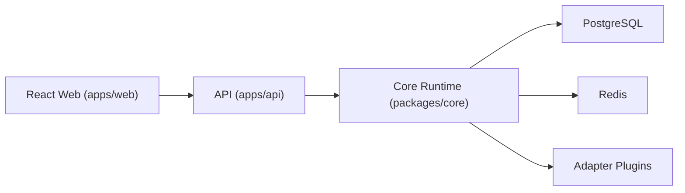

# Integration Platform OSS (v1)

Self-hostable, plugin-based workflow automation for teams that need reliable integrations with operational visibility.

## What This Project Is

This repository contains an open-source integration platform (conceptually similar to Zapier/n8n/Make) built for developers and operators who want:

- workflow automation across multiple providers
- multi-tenant boundaries and role-based access
- retry/dead-letter durability
- run/audit/alert observability
- local extensibility through adapter plugins

## Who It Is For

- engineering teams automating internal or product workflows
- platform/operations teams needing replay/cancel/recovery controls
- OSS contributors building and sharing adapters
- self-hosted users who prefer infrastructure ownership

## Key Features

- JWT auth + tenant/workspace isolation + RBAC
- workflow DSL with mapping, conditions, branches, and delay steps
- retry engine with backoff + dead-letter states
- durable waits (DB-backed delay scheduling)
- manifest-driven plugin loading for adapters
- metrics, analytics, alerts, audit logs, and retention cleanup
- onboarding + templates for fast first-success demos

## Architecture At A Glance

- `apps/api`: Express API and webhook ingress
- `apps/api` worker process: queue consumer for execution/retry/scheduler/alerts/cleanup
- `apps/web`: React operations UI
- `packages/core`: engine, auth, repositories, runtime services
- `packages/shared`: shared types/contracts/utilities
- `packages/adapters/*`: manifest-driven adapter packages
- PostgreSQL: durable system of record
- Redis: queue/backlog coordination



## Quick Start

1. Install dependencies:

```bash
npm install
```

2. Run one-time local setup (creates `.env` if missing, starts Postgres/Redis, verifies infra, migrates, seeds):

```bash
npm run setup:local
```

3. Start app services:

npm run dev:local
```

4. Open:

- Web: `http://localhost:3000`
- API health: `http://localhost:4000/api/v1/health`
- Metrics: `http://localhost:4000/metrics`

### Manual Setup (Advanced)

If you prefer explicit steps:

```bash
npm run env:init
npm run infra:up
npm run migrate -w @integration/core
npm run seed -w @integration/core
npm run dev:local
```

## Local Development Flow

- API and worker details: [`apps/api/README.md`](./apps/api/README.md)
- Web details: [`apps/web/README.md`](./apps/web/README.md)
- Core scripts/tools: [`packages/core/README.md`](./packages/core/README.md)
- Adapter authoring: [`packages/adapters/README.md`](./packages/adapters/README.md)

## First Success Path (End-to-End)

1. Login with seeded defaults:
  - `admin@example.com` / `dev-password`
  - org: `demo-org`
  - workspace: `default`
2. Open `/onboarding`.
3. Connect an integration in `/integrations`.
4. Pick a template in `/workflows`, validate, and create.
5. Trigger a test run.
6. Inspect:
  - `/runs` for execution timeline and retries
  - `/audit-logs` for operator/audit events (owner/admin)
  - `/alerts` to test outbound alerts (owner/admin)
  - `/dashboard` for operational metrics and retention snapshots

## Demo Path and Assets

Demo assets are organized under:

- [`apps/web/demo-assets/README.md`](./apps/web/demo-assets/README.md)

Expected screenshot slots:

- login
- onboarding
- integrations
- workflow template selection
- workflow builder
- runs detail
- dashboard
- alert settings
- audit logs

When screenshots are captured, place them in `apps/web/demo-assets/screenshots/` and link from release notes/README updates.

## Smoke Test Checklist

Use the full launch checklist before release tags:

- [`LAUNCH_CHECKLIST.md`](./LAUNCH_CHECKLIST.md)

Minimal smoke path:

1. install
2. `npm run setup:local`
3. `npm run dev:local`
4. onboarding
5. template workflow creation
6. test run
7. inspect runs/logs/audit/alerts

## Known Limitations (v1)

- no drag-and-drop workflow canvas (form/JSON-assisted builder only)
- no remote plugin marketplace/install flow
- no SSO/SAML/SCIM enterprise identity yet
- no hosted SaaS control plane or billing
- Docker Compose is the primary documented deployment path

## Roadmap Summary

See concise roadmap themes in:

- [`ROADMAP.md`](./ROADMAP.md)

Themes:

- GitOps and deployment maturity
- enterprise identity and governance
- plugin ecosystem expansion
- hosted SaaS readiness
- richer operator workflows

## Deeper Package/App Docs

- API: [`apps/api/README.md`](./apps/api/README.md)
- Web: [`apps/web/README.md`](./apps/web/README.md)
- Core: [`packages/core/README.md`](./packages/core/README.md)
- Adapters: [`packages/adapters/README.md`](./packages/adapters/README.md)

## License

MIT (see package metadata).
