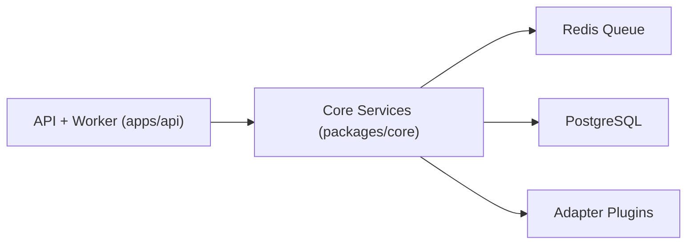
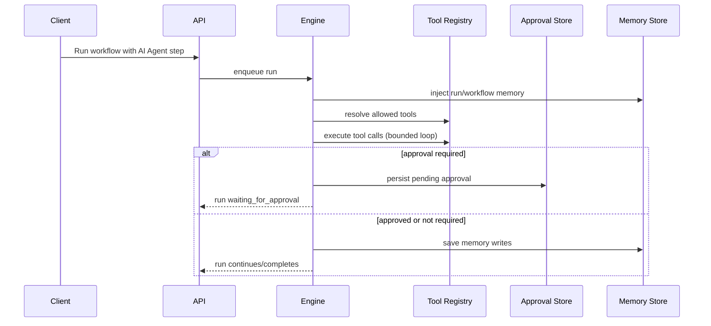

# Integrator Engine Architecture

This document describes the backend-only architecture in this repository.

## Monorepo Structure

### Applications (`apps/*`)

- `apps/api`
  - Fastify API (auth, integrations, workflows, runs, approvals, alerts, audit)
  - webhook ingress
  - worker process entrypoint for queue consumers

### Shared Packages (`packages/*`)

- `packages/core`
  - workflow engine
  - auth + tenant/RBAC enforcement services
  - repositories/migrations
  - retry/dead-letter scheduler, durable waits
  - agent runtime, approval workflow, memory services
  - observability and alert delivery services
- `packages/shared`
  - shared types/interfaces and schemas
  - cross-package helper utilities
- `packages/adapters/*`
  - manifest-driven adapter packages
  - action/trigger implementations exposed to engine runtime

## Runtime Topology

## Workflow Engine Flow

1. Workflow definition is created through API/template endpoints.
2. Trigger event enters system (webhook/schedule/manual test).
3. Engine creates run + logs and enqueues execution work.
4. Worker claims queued work and executes step path.
5. Transient failures schedule retries with backoff.
6. Retry exhaustion moves run to dead-letter state.
7. Delay steps persist wait records and resume via scheduler.

## Agent Runtime Flow

## Enterprise Controls

- JWT-authenticated API surface
- tenant/workspace isolation
- RBAC-protected operator actions
- audit logging for operator and approval actions
- observability via runs, alerts, audit logs, and metrics
