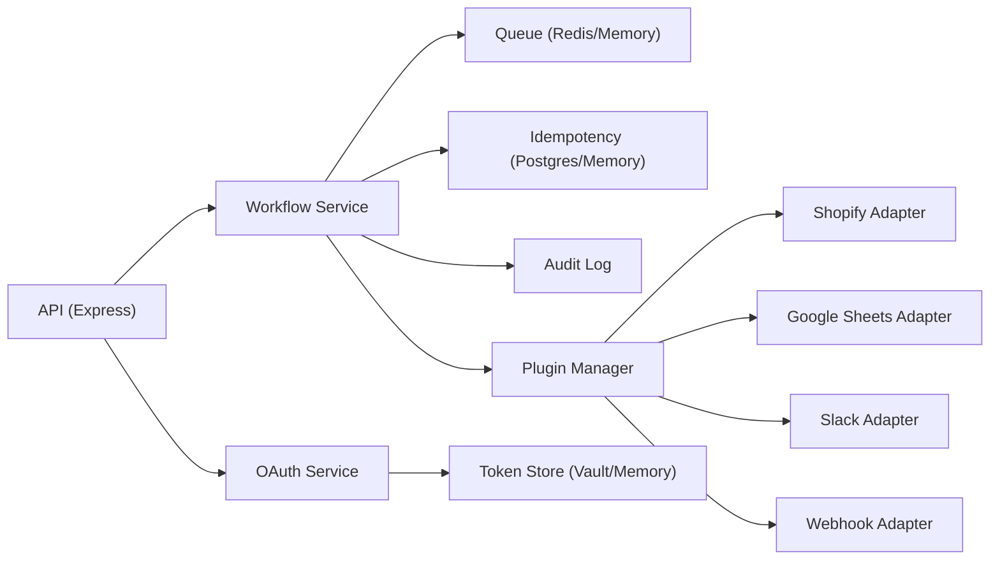
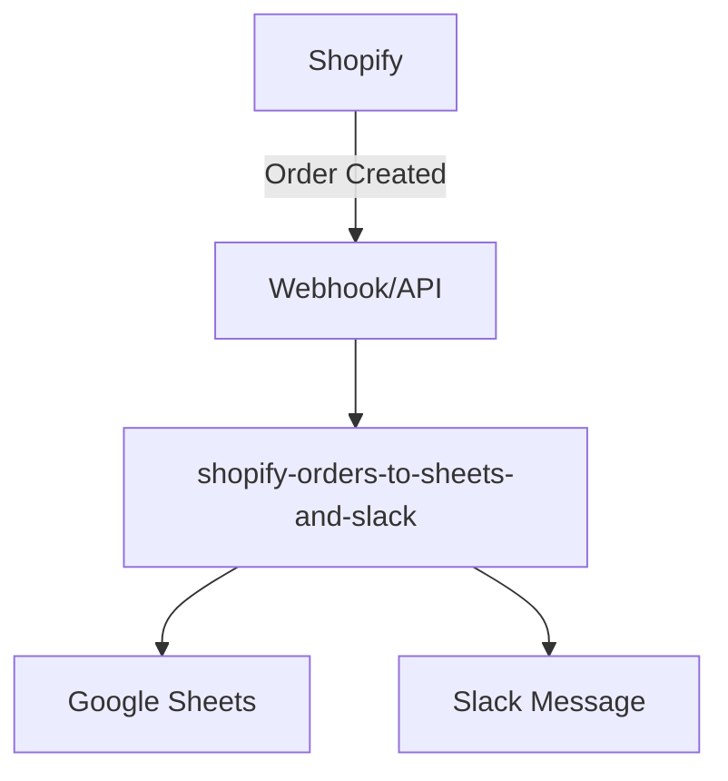

# Architecture

## High-Level Components

- `core/`
  - plugin interface and plugin manager
- `adapters/`
  - runtime-loadable integration adapters
- `src/`
  - API bootstrapping and HTTP routes
  - middleware for request context and rate limiting
  - optional dashboard UI
- `modules/auth/`
  - OAuth2 orchestration
  - Vault token storage
- `modules/integrations/`
  - legacy adapter pattern implementation
  - shared HTTP client with retry and pacing
- `modules/sync/`
  - workflow orchestration
  - Postgres idempotency and retry helpers
- `modules/queue/`
  - Redis-backed durable job queue
- `modules/core/`
  - RBAC and audit logging

## Workflow Execution Model

1. Client calls `POST /api/v1/sync/:workflowId`.
2. RBAC validates permission `sync:run`.
3. Workflow payload is queued.
4. Worker executes the selected workflow:
   - fetch source records from adapter A
   - transform records
   - load records into adapter B
5. Result is written to job state and audit log.

For inbound events, external systems call `POST /api/v1/webhooks/:source`.
The webhook adapter normalizes and verifies payloads before optional workflow dispatch.

### Durable Infrastructure Mapping

- Queue state and processing lists are persisted in Redis.
- Idempotency keys are reserved in Postgres with TTL-backed expiration.
- OAuth tokens are stored in Vault KV paths (`integrator/tokens/<provider>/<tenant>` by default).

## Implemented Workflows

- `salesforce-contacts-to-snowflake`
- `jira-issues-to-servicenow`
- `shopify-orders-to-snowflake`
- `shopify-orders-to-sheets-and-slack`

## Tier-1 Adapters

- `webhook`
- `http-api`
- `scheduler`
- `email`
- `google-sheets`
- `shopify`
- `whatsapp-cloud`
- `slack`

## Production Hardening Path

Current production mapping:

- Token store -> Vault
- Queue -> Redis
- Idempotency store -> Postgres
- Audit log -> in-memory (replace with durable event store as a next step)

Enhancements:

- OpenTelemetry traces and metrics
- Contract tests against sandbox APIs
- Secret rotation automation
- Multi-region data residency controls
