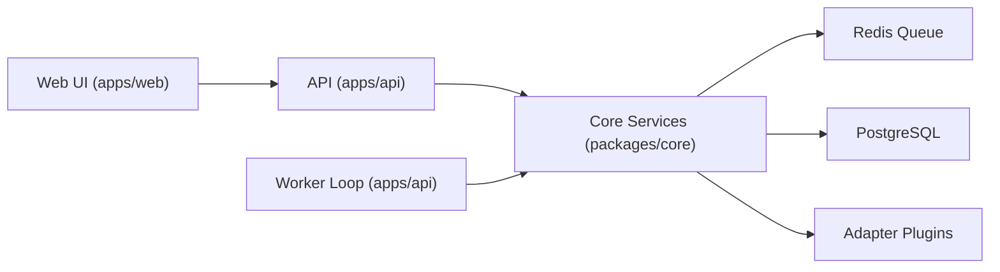
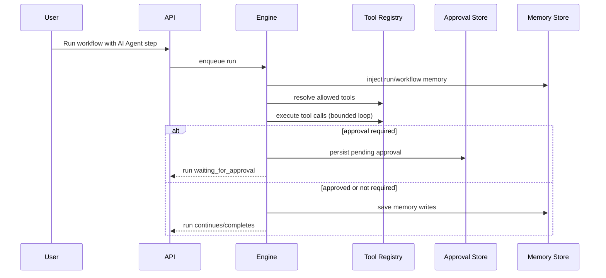

# Integrator Architecture

This document explains the tracked TypeScript monorepo architecture and runtime behavior of Integrator Platform.

## Monorepo Structure

### Applications (`apps/*`)

- `apps/api`
  - Express API (auth, apps/integrations, workflows, runs, approvals, alerts, audit)
  - webhook ingress
  - worker process entrypoint for queue consumers
- `apps/web`
  - React UI for onboarding, app connections, visual builder, runs, approvals, alerts, audit

### Shared Packages (`packages/*`)

- `packages/core`
  - workflow engine
  - auth + tenant/RBAC enforcement services
  - repositories/migrations
  - retry/dead-letter scheduler, durable waits
  - agent runtime, approval workflow, memory services
  - observability and alert delivery services
- `packages/shared`
  - shared types/interfaces
  - AI utility functions
  - cross-package helper utilities
- `packages/adapters/*`
  - manifest-driven adapter packages (native/generic/community)
  - action/trigger implementations exposed to engine runtime

## Runtime Topology

## Workflow Engine Flow

1. User creates workflow (builder/template/API).
2. Trigger event enters system (webhook/schedule/manual test).
3. Engine creates run + logs and enqueues execution work.
4. Worker claims queued work and executes step path.
5. On transient failure:
  - retries are scheduled with backoff.
6. On retry exhaustion:
  - run enters dead-letter state.
7. On delay step:
  - wait state is persisted and resumed later by scheduler.

## Agent Runtime Flow

## Tool Execution Model

- tools are formalized with metadata:
  - id, title, category, input schema, safety level
- permission boundaries:
  - `allow_all` or explicit `allow_list`
- high-safety tools can require human approval before execution
- execution traces persist reasoning + tool-call summaries for UI timelines

## Approval + Retry Queue Interaction

- approval-required tool calls create persisted approval requests.
- run state pauses in `waiting` with retry job state `awaiting_approval`.
- approve path:
  - marks approval records approved
  - resumes execution from paused step path when eligible
- deny path:
  - blocked tool is not executed
  - run transitions to failure with approval-denied classification

## Memory Injection Model

- short-term memory scope: run-level
- persistent memory scope: workflow-level
- memory lifecycle:
  1. load memory context before AI agent step execution
  2. include memory in agent step input context
  3. persist memory writes after step execution
  4. expose memory through API/UI for visibility and control

## Enterprise Controls

- JWT-authenticated API surface
- tenant and workspace isolation across all protected resources
- RBAC-protected operator actions (cancel/replay/reschedule/approve/deny)
- audit logging for operator and approval actions
- observability stack with runs, alerts, audit logs, and metrics
